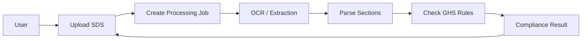
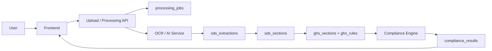

# Regintels 2.0 GHS-Scan

## ICT Handover Document

### 1. Purpose

GHS-Scan is the next SDS compliance module for Regintels 2.0. It will let users upload a new SDS, extract the text through OCR, compare the result with GHS requirements, and display compliance gaps, missing sections, and differences.

This module is designed as a processing pipeline, not as a document editor.

### 2. Status

This module is upcoming. The design should be treated as the target operating model for development and support planning.

### 3. At a Glance

- Input: uploaded SDS file
- Processing: OCR, text extraction, section parsing, compliance evaluation
- Output: compliance status, missing data, differences, and confidence indicators
- Storage rule: keep the SDS workflow auditable and versioned

### 4. Main Flow

### 5. Normal User Journey

1. User uploads an SDS file.
2. The system creates a processing job.
3. The file is sent to OCR or extraction.
4. The extracted text is turned into sections.
5. The sections are compared with GHS reference rules.
6. The system produces a compliance result.
7. The UI shows the result, missing sections, and differences.

### 6. Expected Outputs

The module should show:

- compliance status
- missing or incomplete data
- section differences
- extraction confidence
- processing status
- processing errors when a job fails

### 7. Dependencies

The planned module depends on:

- file upload support
- OCR or document extraction service
- compliance rules engine
- database tables for SDS versions, extraction results, sections, and compliance results
- authentication and access control for sensitive SDS data

### 8. Support Scope

ICT support should be able to:

- confirm whether file upload is working
- confirm whether extraction jobs start
- check whether OCR service credentials are present
- check whether the compliance engine is returning results
- review job status and error logs
- confirm the UI can display the latest result

### 9. What ICT Should Not Treat as a User Error

- OCR service downtime
- missing OCR or AI credentials
- rule engine failures
- database connection failures
- malformed SDS files that the system cannot parse

### 10. High-Level Architecture

### 11. Data Ownership

Planned data areas:

- `chemicals` stores the product or chemical identity
- `sds_versions` stores uploaded SDS versions
- `processing_jobs` stores pipeline status and errors
- `sds_extractions` stores OCR and extraction output
- `sds_sections` stores parsed SDS sections
- `ghs_sections` stores GHS reference sections
- `ghs_rules` stores validation logic
- `compliance_results` stores final results

### 12. Common Issues and Likely Causes

#### Upload fails

Likely causes:
- file too large
- invalid file type
- upload endpoint error

#### OCR does not start

Likely causes:
- OCR credentials missing
- service unavailable
- job creation failed

#### Sections are incomplete

Likely causes:
- low-quality scan
- malformed PDF
- supplier-specific formatting
- OCR text extraction problems

#### Compliance result is missing

Likely causes:
- rule engine failure
- database write failure
- parsing error before evaluation

### 13. How to Verify It Works

When the module is available, ICT should verify:

1. A file can be uploaded.
2. A job record is created.
3. Extraction completes.
4. Parsed sections appear.
5. Compliance results are shown.
6. Errors are visible when a job fails.

### 14. Escalation

Escalate to the development owner if:

- OCR or AI provider credentials are missing
- the rule engine returns inconsistent results
- extracted sections do not map correctly
- the schema changes after deployment

### 15. Summary

GHS-Scan is a workflow-based SDS compliance feature. ICT support should focus on upload behavior, extraction service health, job tracking, and result visibility. The system should always keep an auditable record of each SDS version and processing run.
