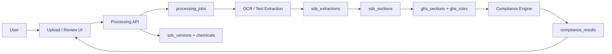
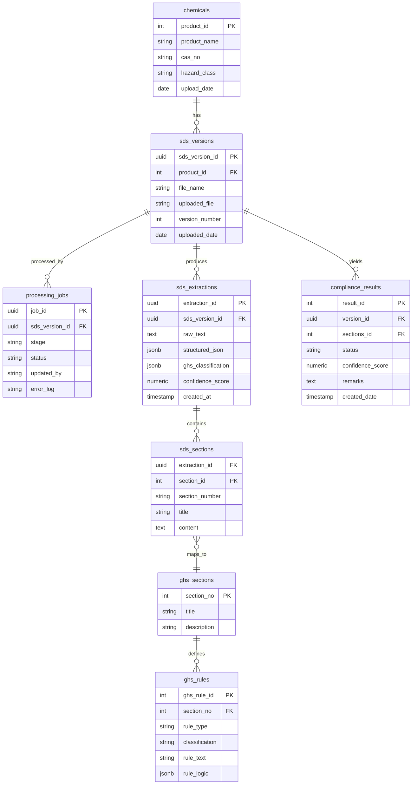

# Regintels 2.0 GHS-Scan

## Technical Report for Development

### 1. Overview

GHS-Scan is the next Regintels 2.0 module for SDS compliance analysis. The module accepts a new Safety Data Sheet, extracts its content through OCR and text parsing, then evaluates the document against the GHS compliance rules engine.

The goal is to show:
- compliance status
- missing or incomplete data
- differences between extracted SDS content and required GHS structure
- traceable results per SDS version and processing run

The module is designed as a live processing pipeline. The uploaded SDS is not treated as a static document viewer; it becomes a structured compliance workload that moves through extraction, section mapping, rule evaluation, and result reporting.

### 2. Goals

- Support upload of new SDS files.
- Run OCR and text extraction on the uploaded file.
- Parse the extracted text into structured SDS sections.
- Compare the extracted content against GHS rules.
- Highlight missing data, deviations, and compliance gaps.
- Preserve each upload as a versioned audit trail.
- Store processing results for review and re-checking.

### 3. Non-Goals

- Authoring or editing SDS content inside Regintels.
- Replacing the source SDS document management system.
- Full legal certification of the SDS.
- Manual compliance judgment in place of the rule engine.
- Storing unneeded raw credentials or unrelated document content.

### 4. System Module Overview

The module is composed of six logical layers:

1. SDS Core
   - Stores chemicals and SDS version metadata.
   - Maintains source file details and version history.

2. Pipeline
   - Tracks each OCR, extraction, and rule-evaluation job.
   - Provides status, error logging, and processing auditability.

3. Extraction Output
   - Holds raw extracted text.
   - Holds structured JSON from parsing.
   - Stores confidence metadata for extraction quality.

4. SDS Sections
   - Breaks the document into normalized section records.
   - Supports section titles, numbering, and content bodies.

5. GHS Reference Data
   - Stores canonical GHS sections and compliance rules.
   - Defines rule logic used by the compliance engine.

6. Compliance Result
   - Stores the final compliance status.
   - Captures score, remarks, and timestamps.

### 5. High-Level Architecture

### 6. Data Flow

1. The user uploads a new SDS file.
2. The backend creates a processing job record.
3. The file is sent to OCR or document extraction.
4. Raw text is captured as extraction output.
5. The extracted content is parsed into structured sections.
6. Sections are matched against the GHS reference structure.
7. The compliance engine evaluates required content, order, and presence.
8. The result is written to the compliance results store.
9. The UI displays the compliance status and the missing or mismatched data.

### 7. Target User Experience

The user should be able to:
- upload a new SDS
- watch the processing state progress
- view the extracted sections
- see which required GHS sections are missing
- inspect confidence and exception details
- review the latest compliance result for each SDS version

### 8. Technical Design

#### 8.1 SDS Core

The SDS core stores the identity of the chemical and the current document lineage.

Suggested entities:
- `chemicals`
- `sds_versions`

Purpose:
- identify each product or chemical
- store the uploaded file reference
- keep version number and upload dates

#### 8.2 Processing Pipeline

The processing pipeline is the orchestration layer for upload and analysis.

Suggested entity:
- `processing_jobs`

Purpose:
- track one document run from start to finish
- store stage, status, and error details
- allow retry and audit history

#### 8.3 Extraction Layer

The extraction layer captures the raw and structured output from OCR and parsing.

Suggested entities:
- `sds_extractions`
- `sds_sections`

Purpose:
- preserve extracted raw text
- preserve structured JSON output
- map OCR output into repeatable SDS sections

#### 8.4 GHS Reference Layer

The reference layer stores the compliance model used by the engine.

Suggested entities:
- `ghs_sections`
- `ghs_rules`

Purpose:
- define required GHS sections
- store rule logic for validation
- support future rule updates without code changes

#### 8.5 Compliance Results

Suggested entity:
- `compliance_results`

Purpose:
- store final status
- store confidence score
- store review remarks
- allow later comparison between versions

### 9. ERD Summary

The ERD in the design image describes the following relationships:

- `chemicals` is the parent entity for SDS records.
- `sds_versions` stores each uploaded SDS version for a chemical.
- `processing_jobs` tracks the workflow execution for a version.
- `sds_extractions` stores extraction output linked to a version.
- `sds_sections` stores normalized extracted sections linked to the extraction.
- `ghs_sections` defines the standard GHS section catalog.
- `ghs_rules` stores validation rules linked to GHS sections.
- `compliance_results` stores the final evaluation linked to the version and section set.

### 10. ERD Diagram

### 11. Processing Stages

#### Stage 1: Upload

- User uploads an SDS file.
- Backend validates file type and size.
- A new version row is created.

#### Stage 2: OCR

- File is passed to OCR or extraction service.
- Raw document text is captured.
- Extraction confidence is recorded.

#### Stage 3: Parsing

- Text is segmented into sections.
- Section numbering and titles are normalized.
- Structured section records are saved.

#### Stage 4: Compliance Evaluation

- Rules engine compares parsed sections to GHS rules.
- Missing sections and weak content are flagged.
- Differences are summarized as remarks and score.

#### Stage 5: Result Presentation

- User sees compliance status.
- Missing sections are highlighted.
- Processing history remains available for review.

### 12. Matching and Rule Strategy

The compliance engine should evaluate:

- presence of mandatory GHS sections
- completeness of section content
- section numbering and ordering
- required hazard descriptors
- missing core text blocks
- invalid or low-confidence extraction

The rule engine should prefer:
- explicit structural checks
- section presence checks
- keyword and label checks
- rule logic stored in data rather than hard-coded if possible

### 13. Data Integrity and Auditability

The module should preserve:

- the uploaded file reference
- the exact extraction result
- the normalized section records
- the compliance score
- the stage and status of processing
- any failure reason or retry context

This allows:
- comparison across versions
- traceability for support
- repeatable compliance review

### 14. Security and Access Control

- Only authorized users should upload or review SDS files.
- Uploaded documents may contain sensitive product information.
- Access to raw files and extracted text should be controlled.
- Logs must not expose secrets or private file contents.
- Credentials for OCR or AI services should remain in server-side env vars.

### 15. Reliability and Operational Requirements

- Processing jobs should be restartable.
- Failed jobs should preserve error context.
- The system should show clear status transitions:
  - pending
  - extracting
  - classifying
  - completed
  - failed
- The UI should remain usable even when extraction fails.

### 16. Risks and Issues

Potential issues during development:
- OCR quality may vary by scan quality.
- SDS formatting may differ across suppliers.
- Section segmentation may fail on poorly structured documents.
- Rule tuning may require multiple review cycles.
- AI classification can produce inconsistent results without guardrails.

Operational support concerns:
- missing OCR or AI credentials
- large PDF files
- malformed scanned documents
- inconsistent section names
- incomplete GHS rule definitions

### 17. Suggested Development Phases

#### Phase A: Ingestion and Tracking

- Implement upload endpoint.
- Create SDS version and job records.
- Store raw file reference and upload metadata.

#### Phase B: OCR and Extraction

- Connect OCR service.
- Save raw text and structured JSON output.
- Track confidence and extraction errors.

#### Phase C: Section Parser

- Normalize sections from extracted text.
- Store section records.
- Map sections to the GHS reference model.

#### Phase D: Compliance Engine

- Build validation logic for required sections.
- Score compliance and produce remarks.
- Save result records.

#### Phase E: UI Review Layer

- Show upload progress.
- Display extracted sections.
- Show compliance differences and missing data.

### 18. Testing Strategy

- Unit test OCR parsing helpers.
- Unit test section normalization.
- Unit test rule evaluation and scoring.
- Integration test the upload-to-result pipeline.
- Test malformed PDFs and low-quality scans.
- Test missing env vars and service errors.

### 19. Support Checklist

If GHS-Scan fails in development:

1. Check OCR and AI environment variables.
2. Check file upload size and type.
3. Check processing job status and error log.
4. Check extraction confidence values.
5. Check the GHS rule catalog.
6. Verify the SDS section parser against the current sample document.

### 20. Conclusion

GHS-Scan should be implemented as a versioned, auditable, pipeline-driven module. The design separates upload handling, OCR extraction, parsing, compliance evaluation, and reporting. This makes the system easier to support, easier to extend, and safer for SDS compliance workflows.
