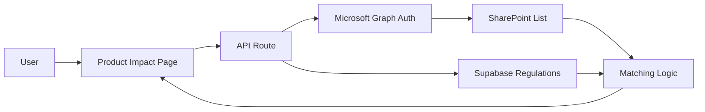

# Regintels 2.0 Product-Impact Flow

## ICT Handover Document

### 1. Purpose

The Product-Impact Flow lets users review how SharePoint product metadata is affected by regulations. The page reads product data live from SharePoint, compares it with regulation search profiles, and shows the impact results in the UI.

Product rows are not stored in Supabase. SharePoint remains the source of truth for product metadata.

### 2. Audience

This document is for ICT support staff who need to understand:

- what the module does
- what it depends on
- what to check when it fails
- when to escalate

### 3. At a Glance

- Data source: SharePoint List
- Authentication: Microsoft Graph
- Regulation source: Supabase
- Storage rule: product rows are not saved in Supabase
- User outcome: live product impact results by regulation or by product

### 4. Main Flow

### 5. Normal User Journey

1. User opens the Product Impact page.
2. The page requests live product data.
3. The backend authenticates to Microsoft Graph.
4. The backend reads rows from the SharePoint list.
5. Product fields are normalized in memory.
6. Regulations and search queries are read from Supabase.
7. The matcher compares the product against regulations.
8. The UI shows the result and the SharePoint source link.

### 6. Dependencies

Required environment variables in `.env.local`:

- `MS_TENANT_ID`
- `MS_CLIENT_ID`
- `MS_CLIENT_SECRET`
- `MS_SHAREPOINT_SITE_ID`
- `MS_SHAREPOINT_LIST_ID`

Other dependencies:

- Microsoft Entra app registration
- Microsoft Graph application permissions
- SharePoint list containing product metadata
- Supabase regulations table and regulation search profiles

### 7. What ICT Should Support

ICT support is expected to:

- verify Microsoft Graph configuration
- verify SharePoint site and list IDs
- check whether the SharePoint schema changed
- confirm the app was restarted after env changes
- review error messages shown in the UI
- escalate Graph permission or SharePoint access issues to the app owner or M365 admin

### 8. What ICT Should Not Change Without Approval

- SharePoint product records
- regulation search profiles in Supabase
- Microsoft Entra permissions
- production secrets in `.env.local`
- matching logic unless the owner approves the change

### 9. How to Verify the Module Works

1. Open the Product Impact page.
2. Confirm the page loads without the missing-config error.
3. Search a known product category such as `LLDPE`.
4. Confirm the page shows live matched rows.
5. Open a product row and verify the SharePoint source link, if present.

### 10. Common Issues and Fixes

#### Missing Microsoft config

Symptom:
- The page shows missing environment variables.

Likely cause:
- `.env.local` does not contain the Microsoft Graph values.

Action:
- Add the missing values and restart the dev server.

#### No data returned

Symptom:
- Page loads but shows no matches.

Likely cause:
- The SharePoint list is empty, the category filter is too narrow, or regulation search terms are too weak.

Action:
- Try another category.
- Confirm the SharePoint list contains the expected product rows.
- Confirm regulation search queries exist.

#### SharePoint auth failure

Symptom:
- UI shows a Microsoft Graph error.

Likely cause:
- invalid tenant ID, client ID, client secret, or missing Graph permission

Action:
- Confirm the Entra app registration and admin consent.

#### Field mapping looks wrong

Symptom:
- Product name, grade, or family is not shown correctly.

Likely cause:
- SharePoint field names changed.

Action:
- Check the SharePoint column names against the field mapping in the code.

### 11. Support Checklist

If the page fails, check:

1. `.env.local` values
2. Microsoft Entra app registration
3. Graph permissions and admin consent
4. SharePoint site ID and list ID
5. SharePoint list field names
6. Supabase regulations and search queries

### 12. Escalation

Escalate to the app owner or Microsoft 365 administrator if:

- the Entra app registration is missing
- Graph permissions are rejected
- SharePoint access is blocked
- the issue is caused by a schema change outside ICT control

### 13. Summary

The Product-Impact Flow is a live SharePoint-to-Regintels integration. ICT support should focus on Microsoft Graph configuration, SharePoint list access, and environment variables. Product data is always expected to remain in SharePoint.
