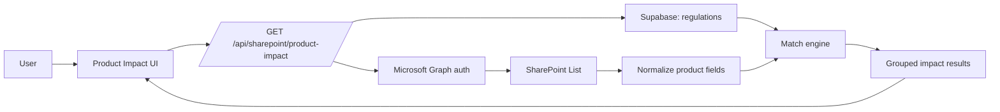
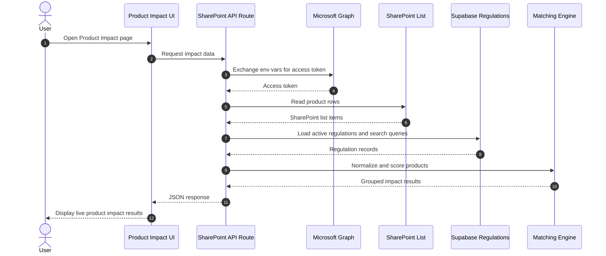

# Regintels 2.0 Product-Impact Flow

## Technical Design Document

### 1. Overview

The Product-Impact Flow is a live integration between Regintels 2.0 and SharePoint. It reads product metadata directly from a SharePoint list through Microsoft Graph, matches each product against active regulations, and renders the computed impact in the UI.

The design intentionally avoids persisting product rows in Supabase. Regulation metadata and regulation search profiles remain in Supabase.

### 2. Goals

- Fetch product metadata live from SharePoint.
- Assess the impact of a product against active regulations.
- Display match results by product or by regulation.
- Preserve SharePoint as the system of record for product metadata.
- Keep product credentials and product rows out of Supabase.

### 3. Non-Goals

- Persisting SharePoint product rows in Supabase.
- Editing SharePoint product data from Regintels.
- Offline caching of product rows.
- Automatic remediation of bad SharePoint schema or bad Microsoft Graph permissions.

### 4. High-Level Architecture

### 5. Component Responsibilities

#### 5.1 SharePoint Graph Module

File: `src/lib/sharepoint/graph.ts`

Responsibilities:
- Read Microsoft Graph configuration from environment variables.
- Obtain an access token using the client credentials flow.
- Fetch SharePoint list items.
- Normalize SharePoint list items into internal product records.
- Score product metadata against regulation search terms.

#### 5.2 Matching Module

File: `src/lib/sharepoint/matching.ts`

Responsibilities:
- Compare normalized products to regulations.
- Filter weak matches.
- Group matches for display by product or by regulation.

#### 5.3 API Route

File: `src/app/api/sharepoint/product-impact/route.ts`

Responsibilities:
- Parse request parameters.
- Fetch SharePoint product rows.
- Load active regulations from Supabase.
- Run the matching engine.
- Return structured JSON for the UI.
- Return clear errors when Microsoft configuration is missing or invalid.

#### 5.4 UI Page

File: `src/app/dashboard/product-impact/page.tsx`

Responsibilities:
- Provide the product and regulation views.
- Trigger live fetches.
- Render match results.
- Surface configuration and fetch errors.
- Keep the user aware that product details remain in SharePoint.

### 6. Data Flow

1. The user opens the Product Impact page.
2. The frontend requests `/api/sharepoint/product-impact`.
3. The API reads Microsoft Graph env variables from `.env.local`.
4. The API authenticates with Microsoft Graph using the tenant ID, client ID, and client secret.
5. The API fetches SharePoint list rows using the site ID and list ID.
6. Each row is normalized into the internal product record shape.
7. The API loads regulation rows and regulation search queries from Supabase.
8. The matcher compares product metadata with regulation search terms.
9. The API groups the matches for the selected view.
10. The UI renders the result and optional SharePoint source link.

### 7. Data Sources

#### 7.1 SharePoint

SharePoint is the source of truth for product metadata.

Typical fields used by the matcher:
- product name
- product family
- product grade
- plant
- application
- source sheet
- confidentiality

#### 7.2 Supabase

Supabase is used for regulation data only.

Typical fields used by the matcher:
- regulation name
- regulation search queries

### 8. Environment Configuration

The following variables are required in `.env.local`:

- `MS_TENANT_ID`
- `MS_CLIENT_ID`
- `MS_CLIENT_SECRET`
- `MS_SHAREPOINT_SITE_ID`
- `MS_SHAREPOINT_LIST_ID`

The current implementation fails fast and surfaces a visible UI error if any of these are missing.

### 9. Matching Strategy

The matcher uses lexical overlap between regulation search terms and product metadata.

Inputs to matching:
- regulation name
- regulation search queries
- normalized product metadata

Matching output:
- numeric match score
- textual match reason
- evidence tokens
- grouped results for display

Current behavior:
- higher scores indicate stronger lexical overlap
- low-score matches are filtered out
- the detail panel shows the strongest matching regulations for a selected product

### 10. Error Handling

Expected error cases:
- missing Microsoft Graph env vars
- invalid Microsoft credentials
- invalid SharePoint site ID
- invalid SharePoint list ID
- Microsoft Graph permission failures
- empty or malformed SharePoint fields
- regulation lookup failures in Supabase

Error handling approach:
- return a structured JSON error from the API
- show a readable message in the UI
- do not store SharePoint product rows in Supabase

### 11. Security and Data Handling

- Product metadata is fetched live from SharePoint only.
- Product credentials are not stored in Supabase.
- Access tokens are acquired only at request time.
- The system should not log secrets or token payloads.
- SharePoint source links are displayed only when available.

### 12. Operational Notes

- Restart the dev server after changing `.env.local`.
- Confirm the Microsoft Entra app registration exists and has Graph permissions.
- Confirm the SharePoint site and list IDs are correct.
- Confirm the SharePoint field names match the expected schema.

### 13. Known Issues and Risks

- Missing env vars prevent product data from loading.
- Schema drift in SharePoint can reduce field mapping accuracy.
- Weak regulation search queries can produce low-quality matches.
- Large lists may require pagination if the SharePoint list grows.
- The feature depends on live SharePoint and Microsoft Graph availability.

### 14. Future Improvements

- Add pagination for large SharePoint lists.
- Add a field-mapping diagnostic view for SharePoint schema mismatches.
- Improve matching with explicit CAS and nomenclature parsing.
- Add admin diagnostics for Graph connectivity and permissions.

### 15. Mermaid Sequence Diagram

### 16. Support Checklist

If the Product Impact page fails:

1. Check whether `.env.local` contains all Microsoft Graph variables.
2. Confirm the Entra app registration is active.
3. Confirm Graph permissions and admin consent are correct.
4. Confirm the SharePoint site ID and list ID are correct.
5. Confirm the SharePoint list schema still matches the expected field names.
6. Restart the dev server after any environment change.
